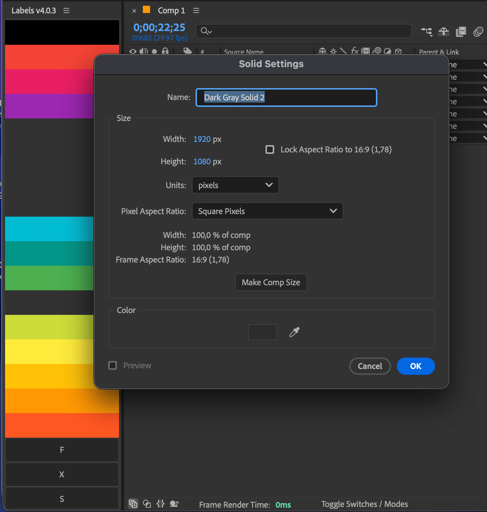
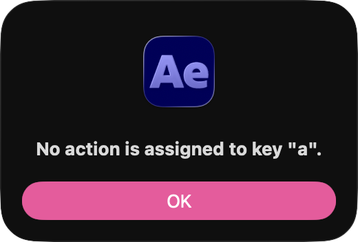

# Known issues

All notable issues will be listed here.

---

## Labels do not update in AE

Sometimes After Effects does not redraw the interface once you install or switch to a new labels theme. To fix this, simply mouse-click anywhere in the AE interface (timeline, preferably) to force AE to redraw the interface.

## Label colors are gone

When a modal window is open in After Effects, mouse-overing any color button may cause it to disappear. This is a known After Effects quirk that is easily fixed by hovering over the 'missing' buttons once the modal window has been closed.

## Cannot color Layers and Items

Ensure that the [Settings > Set color](/interface#settings) option is enabled, and verify whether any modifier keys are assigned to it. By default, no modifier keys should be assigned to this action.

## Cannot color Keyframes

Requires AE v22.6 or later.

To color keyframes, hold the `CMD` key (on Mac) or the `CTRL` key (on Windows) while clicking on a label. If this method does not work, ensure that the [Settings > Target keyframes](/interface#settings) option is enabled. Additionally, verify which keyboard modifier key is assigned for this action and use that key instead.

## Error: "No action is assigned"

The script performs actions based on your **keyboard state** at the moment you click a button. It checks for specific modifier keys (like CMD or SHIFT) or custom assignments to determine if you want to color a layer or a keyframe, select a group, or run a script.

The message **"No action is assigned to [Key]"** appears when:

- **The script detects a key is being pressed** (e.g., the "A" key or "0").
- **No function has been mapped** to that specific key in your Settings.

### Root cause

In many cases, this happens because the script receives a "stuck" signal from the operating system, making it believe a key is being held down even if you aren't touching it. This can be caused by:

- **Third-party extensions or utilities** interfering with keyboard input.
- **Temporary OS glitches** or After Effects quirks.
- **Virtual or hardware-specific keys** (like F22) being reported by the system.

### How to fix

Because this signal is generated by the OS or After Effects before it reaches the script, it is outside of the script's direct control.

> **Note:** Simply restarting After Effects usually will not clear this state. To fix it, you will need to **restart your computer**.

## It just does not work

In some rare cases, when Labels refuse to work, it's recommended to delete the preferences files and start over. To do this, follow the steps below:

  1. In After Effects, open the **Settings** window and navigate to the **Startup & Repair** section.
  2. Click the **Reveal Preferences in Finder** button. This will open a new folder where the After Effects preference files are stored.
  3. Close After Effects.
  4. Locate and delete the following two files. *NOTE: These files contain configuration options for your other installed scripts as well as some internal After Effects preferences, so back these files up if you need to revert this step.*
     - Adobe After Effects [version] Prefs-indep-general.txt
     - Adobe After Effects [version] Prefs.txt
  5. Launch After Effects and Labels.
