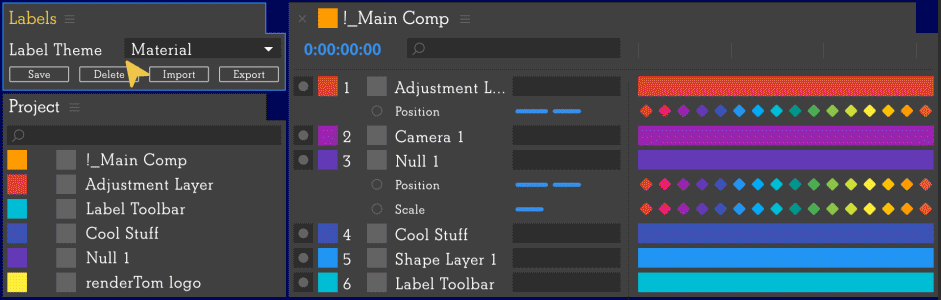

# Themes

> Themes bring power to After Effects to switch label colors at any time without the need to restart application. Try different label colors, assignments, and save them to a file to share with the team.

---

## Download

Download all the themes at once [here](https://github.com/rendertom/Labels/releases/download/assets/Themes.zip ':ignore') or pick the one you like from the list below (and save it with extension *.theme*).

* [David Arbor](https://www.davidarbor.com/) theme 
* Generic Color Game Palette v16 CGP by [Arne Niklas Jansson](http://androidarts.com/palette/16pal.htm) 
* Material theme based on [Google Material Design](https://material.io) 
* Colection of pastel colors 
* [Paul Conigliaro](http://conigs.com) ( [@Conigs](https://twitter.com/conigs) ) theme 
* Pico-8 Game Console Palette by [Lexaloffle](https://lexaloffle.com/pico-8.php) 
* [Ryan Summers](http://ryansummers.net) ( [@Oddernod](https://twitter.com/Oddernod) ) theme with custom Label Assignments 
* Vivid, almost random colors with bold hues 

---

## How to install

1. [Download](#download) the theme file and unzip it.
2. In the [Labels](/interface#main-ui) interface click on the **Settings (S)** button to open up the [Settings](/interface#settings) window.
3. In the [Settings](/interface#settings) window *Themes* section, click the **import** button and select the theme you downloaded and unzipped in step #1. This file should have the *.theme* extension.
4. Click the **save settings** button to confirm.

If the label colors do not update in the AE interface, see this [issue](/known-issues#labels-do-not-update-in-ae).
